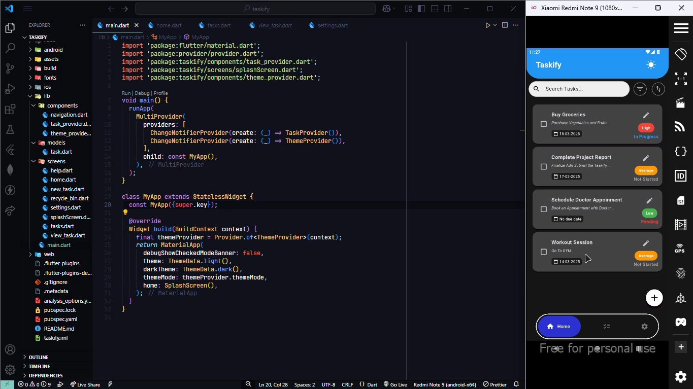

# Taskify - Task Management App

Taskify is a simple and efficient task management application built with Flutter. It allows users to create, organize, and prioritize tasks with ease. The app features task sorting, a recycle bin, backup & restore functionality, and a customizable theme.

## Features
- **Task Management**: Add, edit, delete, and prioritize tasks.
- **Sorting & Filtering**: Sort tasks by name, due date, and priority.
- **Recycle Bin**: Recover deleted tasks before they are permanently removed.
- **Backup & Restore**: Save tasks locally and restore them when needed.
- **Dark & Light Mode**: Customize the theme based on user preference.

## Screenshots


## Installation
1. Clone this repository:
   ```sh
   git clone https://github.com/PraveenTech005/Taskify.git
   ```
2. Navigate to the project directory:
   ```sh
   cd taskify
   ```
3. Install dependencies:
   ```sh
   flutter pub get
   ```
4. Run the application:
   ```sh
   flutter run
   ```

## File Storage Path
Backups are saved in:
```
Android/data/com.yourapp.taskify/files/backup/
```

## Contributing
Contributions are welcome! To contribute:
1. Fork the repository.
2. Create a new branch: `git checkout -b feature-branch`
3. Commit your changes: `git commit -m 'Add new feature'`
4. Push to the branch: `git push origin feature-branch`
5. Open a pull request.

## License
This project is licensed under the MIT License - see the [LICENSE](LICENSE) file for details.
